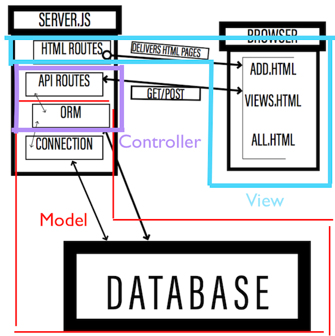

### MVC Solution

* The Model represents the application core (our database and it's hook to our back-end).
* The View displays the data (our HTML routes and the public files).
* The Controller handles the input to our database (accepting input from the view, sending it to the model, taking a response from the model, and sending it back to the view.)

* A great article to checkout can be found here: https://medium.freecodecamp.org/model-view-controller-mvc-explained-through-ordering-drinks-at-the-bar-efcba6255053